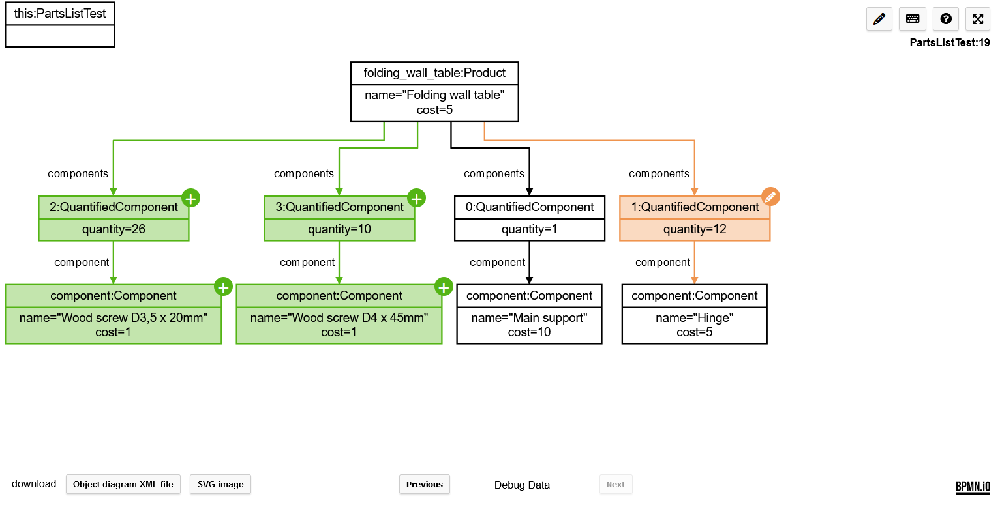

Diffing for object diagrams adapted from [bpmn-js-differ](https://github.com/bpmn-io/bpmn-js-differ).

The diffing tool is used to highlight changes while debugging in the [visual debugger plugin](https://plugins.jetbrains.com/plugin/16851-visual-debugger).
For example:

## License

MIT
